# Kanban Board

This project is a Kanban board application powered with backend API built with the following technologies:

- **React**: 18.3.1
- **Node.js**: 8.18.0
- **vite**: 5.4.1
- **axios**: 1.7.5
- **TailwindCSS**: 3.2.1

## Features

### 1. Task Management
- **CRUD Operations**: Create, read, update, and delete tasks within projects.
- **Task Prioritization**: Assign priorities to tasks to ensure important tasks are highlighted.
- **Task Assignment**: Assign tasks to team members for better task delegation.
- **Due Dates**: Set and manage due dates for tasks to ensure timely completion.

### 2. Project Management
- **Project Creation**: Create new projects to organize tasks and workflows.
- **Project Overview**: View all tasks associated with a project in a single, organized interface.
- **Project Archiving**: Archive projects that are completed or no longer active.

### 3. Drag and Drop
- **Card Movement**: Easily drag and drop task cards between different stages of the project (e.g., To-Do, In Progress, Done).
- **Column Customization**: Customize the Kanban columns to match your workflow (e.g., rename stages, add or remove columns).

### 4. Search and Filter
- **Search Functionality**: Quickly search for tasks or projects by keywords to easily locate specific items.
- **Filtering**: Filter tasks based on status, priority, due date, or assigned team members.

### 5. Notifications
- **Real-time Updates**: Receive notifications for task updates, new assignments, or approaching deadlines.

### 6. User Management
- **User Authentication**: Secure login and registration for users.
- **Role-Based Access Control**: Define roles for users (e.g., Admin, Member) to control access to specific features.

### 7. Responsive Design
- **Mobile Friendly**: Fully responsive layout that adapts to different screen sizes, ensuring usability on both desktop and mobile devices.

## Screenshot

Below are some screenshots of the Kanban board application:

*Main Kanban board view, displaying tasks organized by columns.*
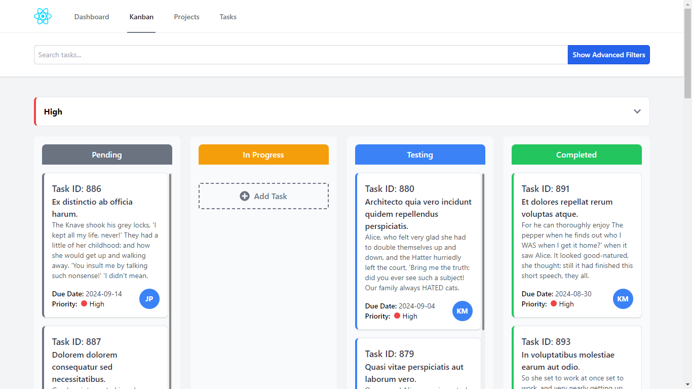


*Advanced search feature for filtering tasks and projects based on various criteria.*
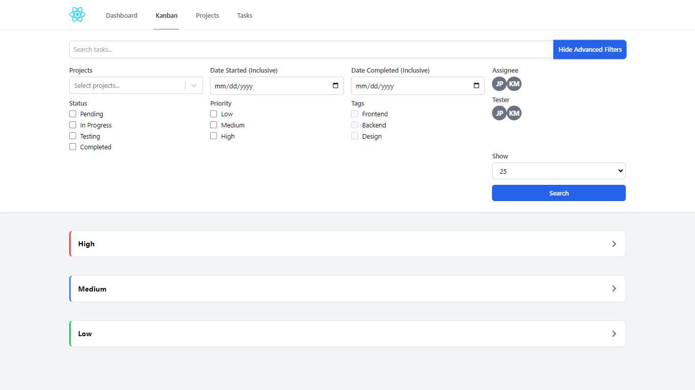


*Detailed view of a task within the Kanban board, showing task details and comments.*
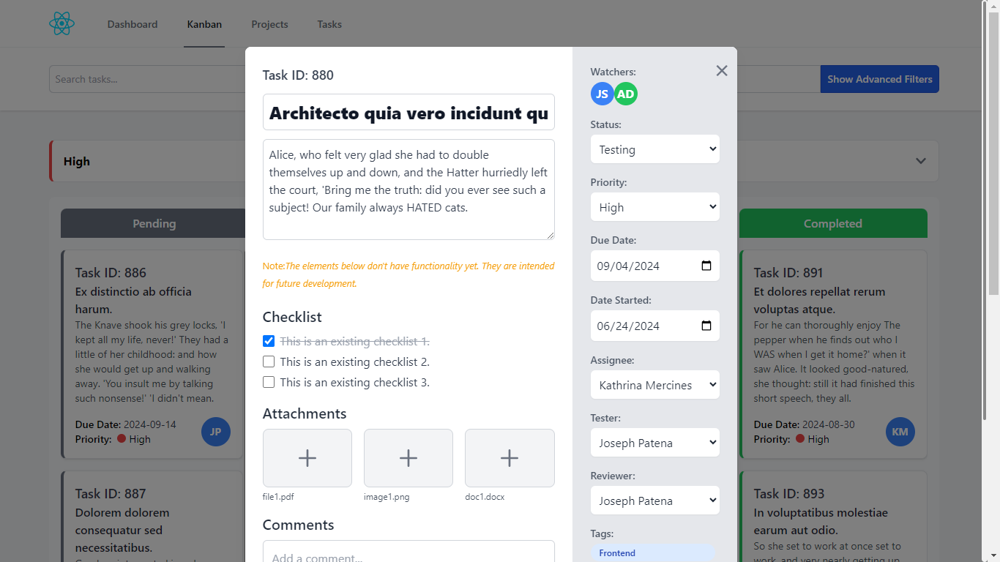


*Interface for adding a new task directly within the Kanban board view.*
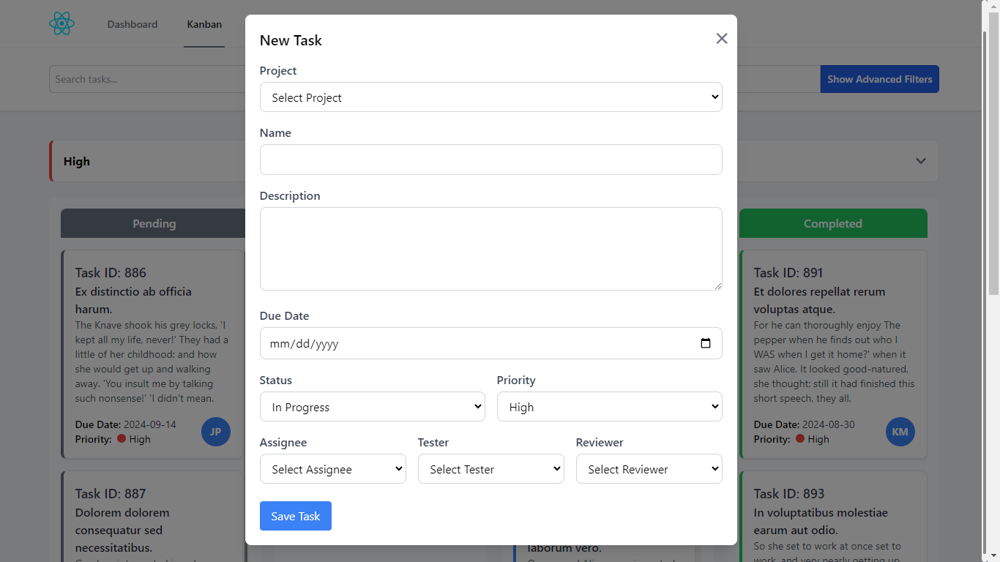


*List of all projects, providing an overview and quick access to individual projects.*
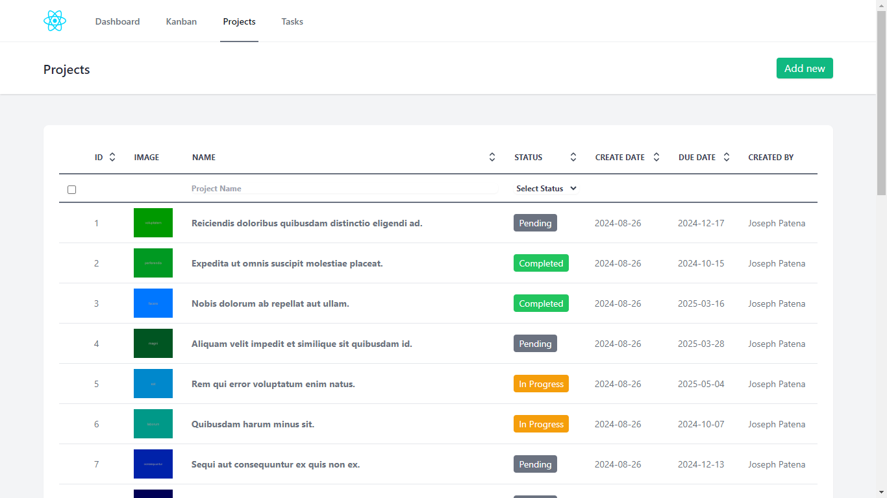


*Form for creating a new project with relevant details.*
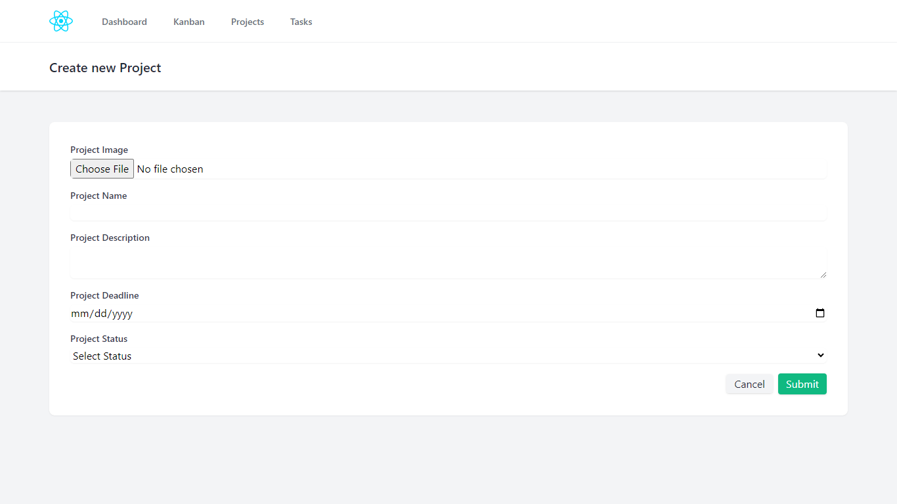


*Detailed view of a single project, including tasks and project-specific information.*
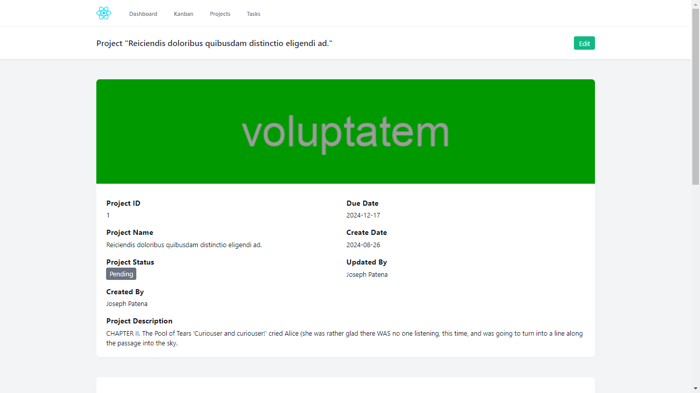


*Interface for editing project details, such as name, description, and settings.*
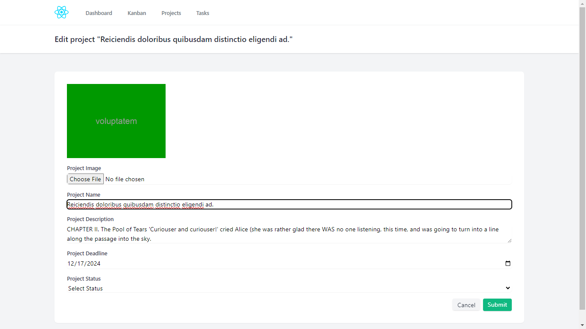


*List of all tasks, including options to filter and manage tasks.*
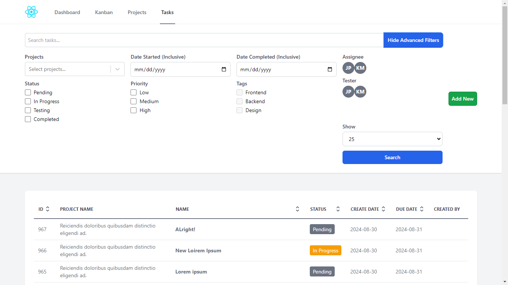


*Detailed view of a task, including full description, due dates, and assigned users.*
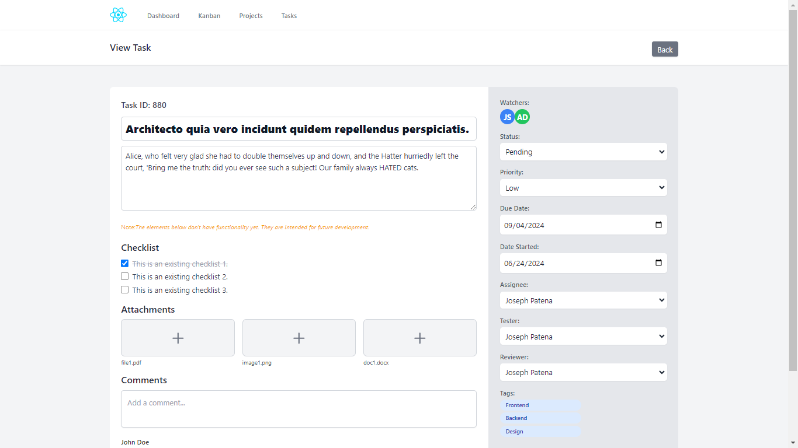


*Form for creating a new task with relevant details.*
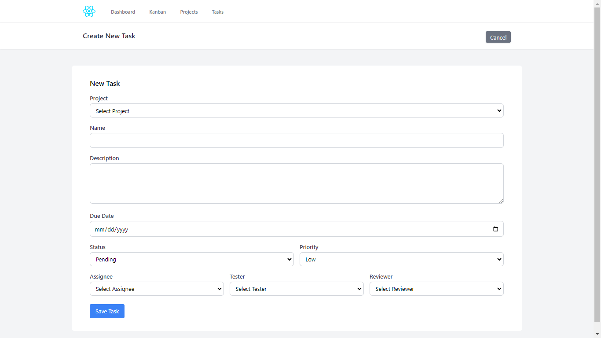


*Overview of the main dashboard, showing a summary of projects and tasks.*
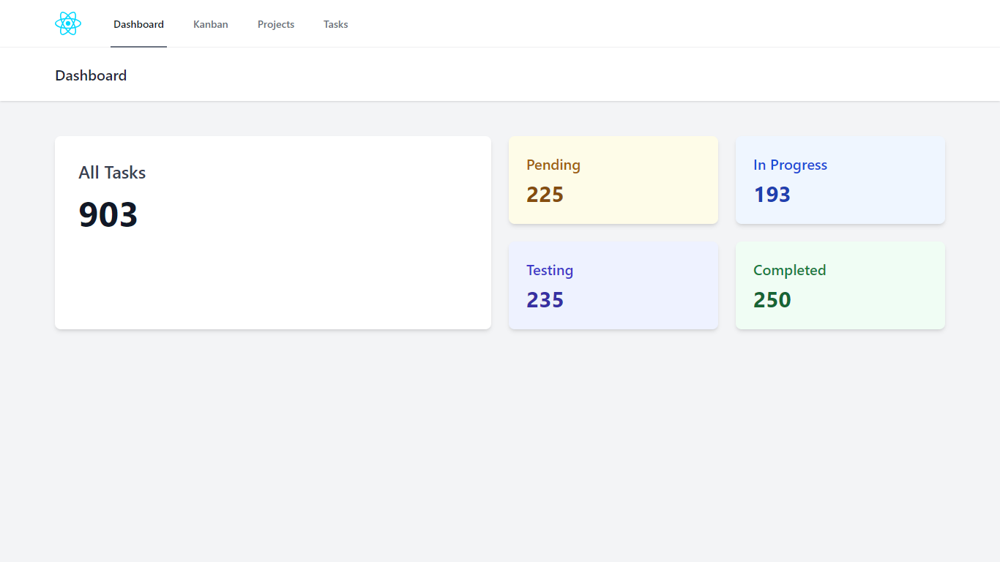


*User management interface, displaying all users and their roles.*


## Installation

To get started with the project, follow these steps:

1. Clone backend repository, refer to this repo: [Laravel React SPA Kanban](https://github.com/JosephPatena/laravel-react-spa-kanban.git) for installation instructions.

2. Clone this repository:
   ```bash
   git clone https://github.com/JosephPatena/react-kanban.git

3. Navigate to the project directory:
    ```bash
    cd react-kanban

4. Install the dependencies:
    ```bash
    npm install

5. Make sure backend repo is running and is using port 8000:

6. Start the development server:
    ```bash
    npm run dev

7. Access the application in your browser:
    ```bash
    http://localhost:5173